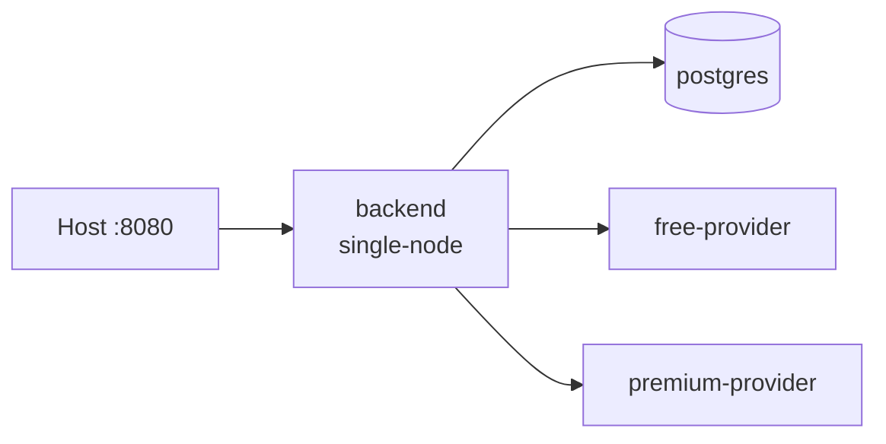
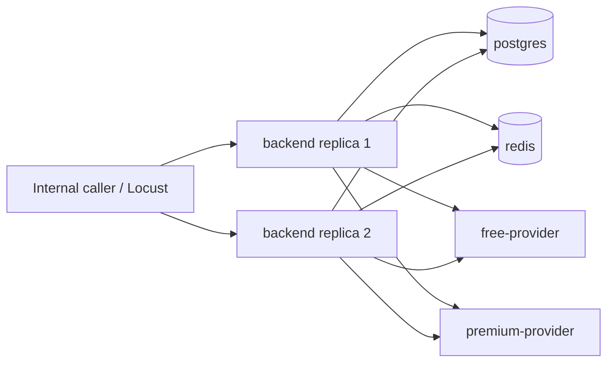

# Deployment Topologies

## Single node

There is one backend replica, local coordination, and no Redis service. This is
the simplest topology for local API exploration.

## Distributed

The distributed Compose overlay removes the host-published backend port on
purpose. It is an internal network topology; use the Locust service or a
temporary internal-network client to exercise it. Redis shares coordination,
rate limits, cache entries, and the expiration lease across replicas.

Development Compose accepts local image tags from `.env.example`. Release
validation must provide digest-pinned image variables. The performance runner
resolves local images to repository digests before starting its Compose stack.
