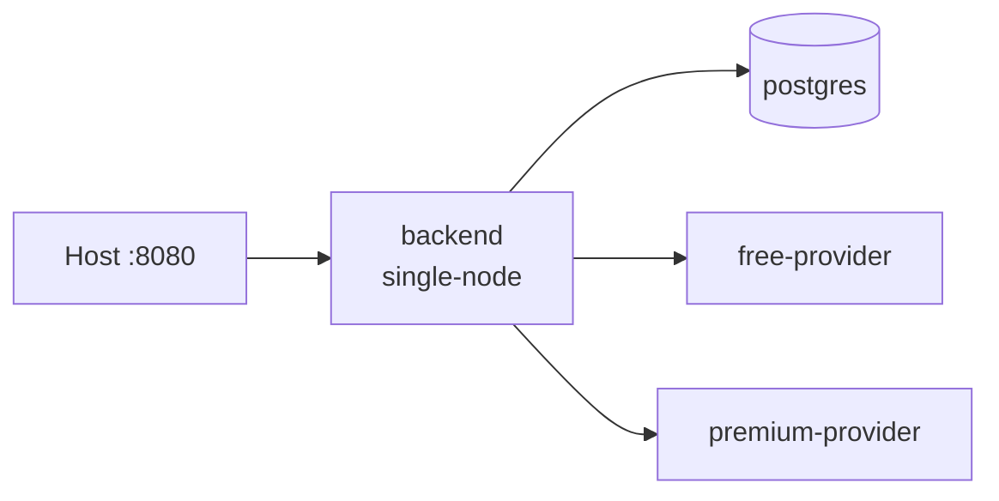
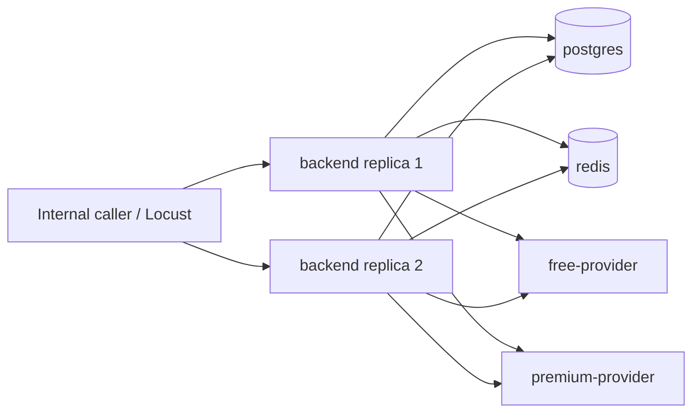
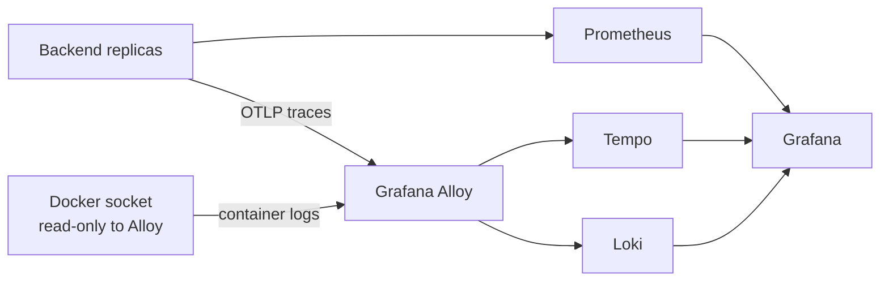

# Deployment Topologies

The build produces two application artifacts before deployment: a Spring Boot
executable JAR and a Paketo OCI backend image. The provider build produces a
compiled Bun `dist` tree and a non-root provider OCI image. PostgreSQL, Redis,
and observability images are runtime dependencies selected by Compose. See
[Runtime architecture](runtime-architecture.md) for the complete artifact
pipeline and [Starting the application](startup.md) for commands.

## Single node

There is one backend replica, local coordination, and no Redis service. This is
the simplest topology for local API exploration.

| Concern | Single-node implementation |
|---|---|
| Verification authority | PostgreSQL via JdbcClient and HikariCP |
| Query coordination | Local in-process lease |
| Result cache | Bounded Caffeine L1 |
| Inbound limit | Local Resilience4j rate limiter |
| Provider quota | Local Resilience4j rate limiter |
| Provider execution | Shared Apache HttpClient 5 pool, retry, circuit breaker, bulkhead |
| Expiration ownership | Local in-process lock |

## Distributed

The distributed Compose overlay removes the host-published backend port on
purpose. It is an internal network topology; use the Locust service or a
temporary internal-network client to exercise it. Redis shares coordination,
rate limits, cache entries, and the expiration lease across replicas.

Development Compose accepts local image tags from `.env.example`. Release
validation must provide digest-pinned image variables. The performance runner
resolves local images to repository digests before starting its Compose stack.

## Observability overlay

The optional `observability` profile can be combined with either topology. The
backend exposes Actuator health/metrics and Micrometer observations. Prometheus
scrapes `/actuator/prometheus`; tracing is exported by OTLP to Alloy; Alloy
forwards traces to Tempo and Docker container logs to Loki; Grafana queries all
three backends through provisioned data sources.

The backend and provider containers never receive the Docker socket. The
observability services use local filesystem volumes and are intended for local
development and smoke testing, not production durability or access control.
