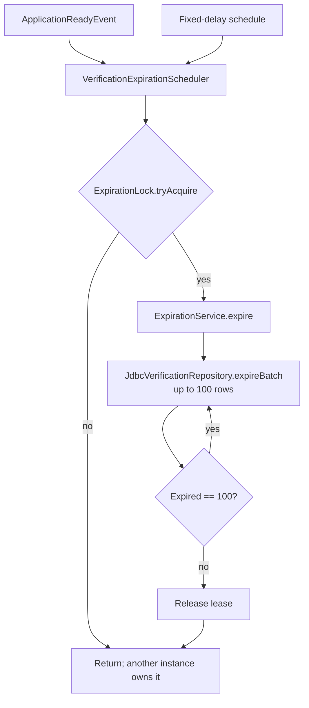

# Expiration and Coordination Flow

Each instance schedules the reaper, but only one instance owns a batch at a
time in distributed mode. The lease has a TTL, and the SQL query orders by
`expires_at`, locks rows with `SKIP LOCKED`, and updates at most 100 records per
batch.

The local profile uses an in-process lock. The distributed profile uses Redis
with a random token, compare-and-delete release, and a bounded TTL. PostgreSQL
remains the final authority, so a lost Redis lease cannot corrupt state.

The scheduler runs once at application readiness and then at the configured
fixed delay. Each pass drains full batches until fewer than 100 rows are
returned. PostgreSQL selects only `IN_PROGRESS` rows whose `expires_at` is in
the past, orders by expiry, uses `FOR UPDATE SKIP LOCKED`, changes them to a
timeout failure, and clears any stale `claim_token` and `claimed_at`. The local
lock prevents duplicate work inside one JVM; the Redis lease prevents duplicate
reapers across replicas.
