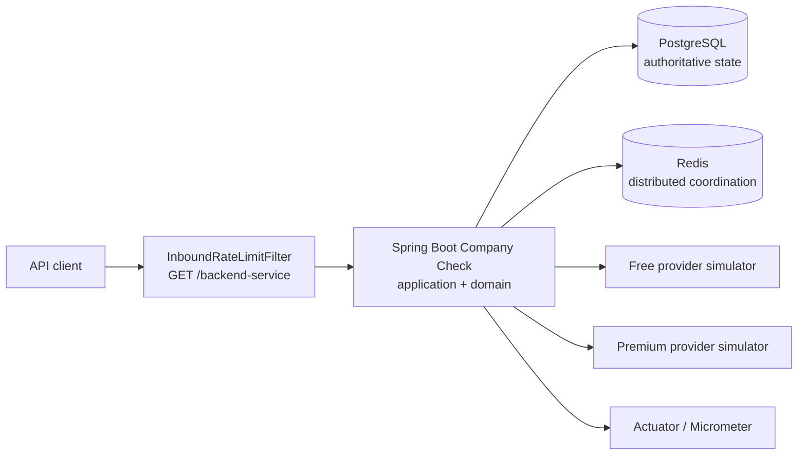

# System Overview

## Boundaries

The application layer owns verification state transitions and use cases. Input
adapters are the HTTP controller and expiration scheduler. Output adapters own
JDBC persistence, Redis coordination/rate limiting, provider HTTP clients, and
local in-memory alternatives.

PostgreSQL is authoritative for verification identity, status, claims, expiry,
and terminal results. Redis is optional in single-node mode and shared in the
distributed profile. The provider service is a deterministic simulator used by
Compose and performance tests; it is not part of the domain model.

## Runtime profiles

| Profile | Coordination | Rate limiting | Use |
|---|---|---|---|
| `single-node` | local memory | Resilience4j | local development and one backend replica |
| `distributed` | Redis | Redis fixed-window limits | multiple backend replicas |

Both profiles use PostgreSQL and the same application/domain behavior.
