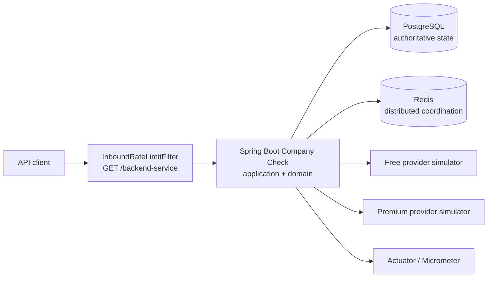

# System Overview

## Boundaries

The application layer owns verification state transitions and use cases. Input
adapters are the HTTP controller and expiration scheduler. Output adapters own
JDBC persistence, Redis coordination/rate limiting, provider HTTP clients, and
local in-memory alternatives.

Spring wiring and externalized settings live under the top-level
`configuration` package. Its subpackages provide context without mixing
concerns: `application`, `persistence`, `coordination`, `provider`, `web`, and
`observability`. `@ConfigurationProperties` records live beside the
configuration that consumes them; adapters may receive those immutable records
through the composition root, while application services receive ports and
plain application values.

Application outcome exceptions live in `application.exception`, not beside the
orchestration classes in `application.service`. This keeps service packages
focused on use cases and lets the inbound web adapter translate application
outcomes to HTTP problem details. Domain validation exceptions remain in their
domain package, and provider transport exceptions remain inside the provider
adapter.

PostgreSQL is authoritative for verification identity, status, claims, expiry,
and terminal results. Redis is optional in single-node mode and shared in the
distributed profile. The provider service is a deterministic simulator used by
Compose and performance tests; it is not part of the domain model.

## Runtime profiles

| Profile | Coordination | Rate limiting | Use |
|---|---|---|---|
| `single-node` | local memory | Resilience4j | local development and one backend replica |
| `distributed` | Redis | Redis fixed-window limits | multiple backend replicas |

Both profiles use PostgreSQL and the same application/domain behavior.

## Cross-cutting infrastructure

The backend uses Java virtual threads for request and scheduling work, but
back-pressure remains explicit at every scarce resource: Hikari connections,
the shared Apache HttpClient 5 connection pool, provider bulkheads and rate
limits, Redis coordination waiters, and expiration batches. Caffeine is the
bounded local result cache in both profiles; Redis adds shared cache,
coordination, leases, and fixed-window limits only in the distributed profile.

The optional observability overlay adds Prometheus for Actuator metrics, Alloy
as the OTLP and Docker-log collector, Tempo for traces, Loki for logs, and
Grafana as the query/UI layer. It can be combined with either runtime profile;
the backend receives no Docker socket.

For the complete build artifact pipeline and topology diagrams, see
[Runtime architecture](runtime-architecture.md). For protection and failure
semantics, see [Resilience and fallback](resilience.md).
