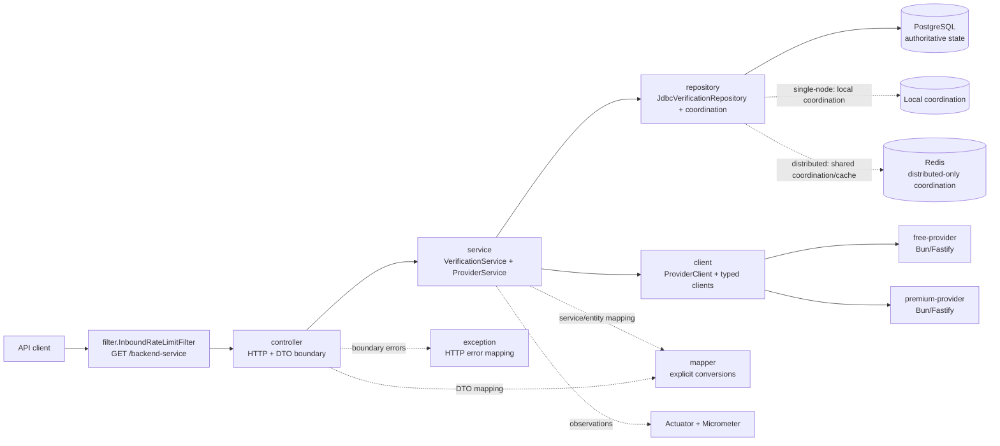

# System Overview

## Boundaries

The backend is one Spring Boot Modulith module with conventional layers:

| Layer | Current package | Responsibility |
|---|---|---|
| Configuration | `com.incode.verification.config` | Spring beans, profiles, properties, resource limits, resilience, HTTP clients, and runtime hints |
| Controller | `com.incode.verification.controller` | Routes, request/response DTOs, inbound admission, and scheduled expiration trigger |
| Service | `com.incode.verification.service` | Verification lifecycle, idempotency/conflict rules, provider fallback, recovery, storage orchestration, and expiration use case |
| Repository | `com.incode.verification.repository` | PostgreSQL JDBC, local/Redis coordination, leases, caches, and rate-limit implementations |
| Client | `com.incode.verification.client` | `ProviderClient`, typed FREE/PREMIUM HTTP clients, provider wire DTOs, and resilience wrappers |
| Mapper | `com.incode.verification.mapper` | Explicit DTO, service-model, entity, provider, and state conversions |
| Exception | `com.incode.verification.exception` | Business/integration failures and `GlobalExceptionHandler` HTTP translation |
| Utility | `com.incode.verification.util` | Small framework-free utilities such as UUID generation |

Controllers depend on services and `VerificationMapper`. Services use
repository and provider-client contracts, but do not depend on JDBC, Redis,
Spring MVC, or provider wire DTOs.
Repository entities and provider DTOs stay inside their owning layers; mapper
classes perform explicit conversions. `config` is the composition root for
profile-specific implementations.

PostgreSQL is authoritative for verification identity, status, claims, expiry,
and terminal results. Caffeine is the bounded local result cache. Redis is
optional in `single-node` and shared in `distributed` for query coordination,
cache entries, leases, and fixed-window limits. The provider service is a
deterministic Bun/Fastify simulator used by Compose and performance tests; it is
not part of the backend service model.

## Runtime profiles

| Profile | Coordination | Rate limiting | Use |
|---|---|---|---|
| `single-node` | Local coordination plus Caffeine | Resilience4j | Local development and one backend replica |
| `distributed` | Redis coordination plus shared cache | Redis fixed-window limits | Multiple backend replicas |

Both profiles use PostgreSQL and the same service/controller behavior.

## Cross-cutting infrastructure

The backend uses Java virtual threads for request and scheduling work, while
back-pressure remains explicit at Hikari, the shared Apache HttpClient 5 pool,
provider bulkheads/rate limits, Redis waiters, and expiration batches.

The optional observability overlay adds Prometheus, Grafana Alloy, Tempo, Loki,
and Grafana. The backend exports metrics/traces; Alloy reads Docker logs from a
read-only socket mount and forwards telemetry. The backend and provider
containers never receive that socket.

For source/build artifacts and topology diagrams, see
[Runtime architecture](runtime-architecture.md). For protection and failure
semantics, see [Resilience and fallback](resilience.md).
