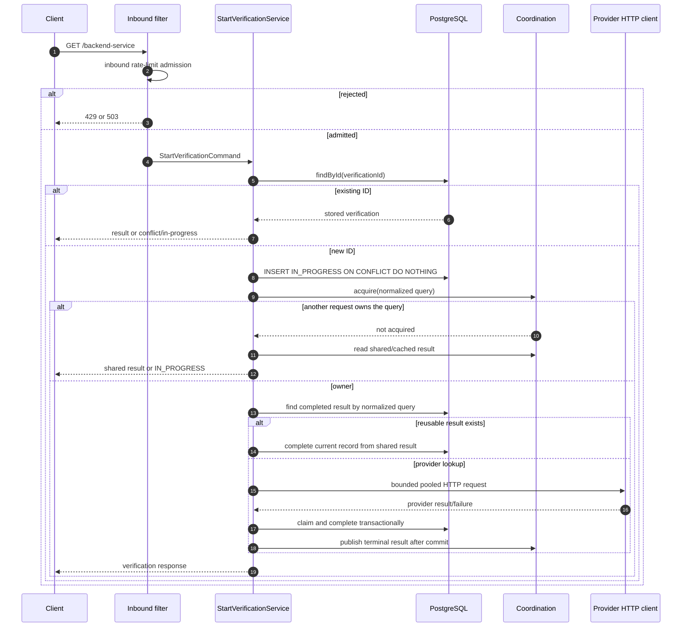

# Request Flow

## Start or retrieve a verification

The public operation is `GET /backend-service?verificationId=...&query=...`.
The same verification ID and normalized query are idempotent; reusing the ID
with another normalized query is a conflict.

`GET /verifications/{verificationId}` is read-only and bypasses provider
lookup. Provider retry, circuit-breaker, rate-limit, and bulkhead policies apply
only at the provider boundary.
