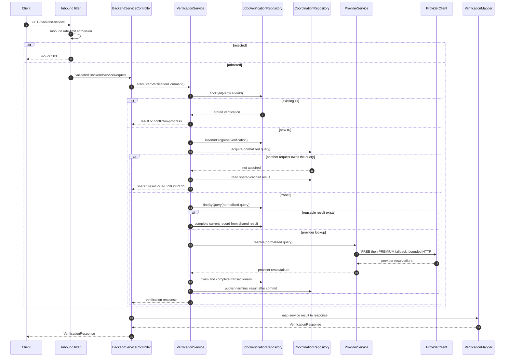

# Request Flow

## Start or retrieve a verification

The public operation is `GET /backend-service?verificationId=...&query=...`.
The same verification ID and normalized query are idempotent; reusing the ID
with another normalized query is a conflict.

`GET /verifications/{verificationId}` is read-only and bypasses provider
lookup. Provider retry, circuit-breaker, rate-limit, and bulkhead policies apply
only at the provider boundary.

## Admission, provider fallback, and storage order

The request path has three independent protection stages:

1. `InboundRateLimitFilter` admits only the start endpoint. A local
   Resilience4j limiter is used in `single-node`; a Redis atomic fixed-window
   script is used in `distributed`. Rejection returns `429` with `Retry-After`;
   Redis unavailability returns `503` and does not bypass the limit.
2. `ProviderService` calls the free provider first. Unavailable,
   timeout, malformed, circuit-open, bulkhead-rejected, or quota-rejected
   results trigger the premium fallback. A known provider 4xx is a client error
   and does not trigger fallback.
3. `VerificationStoreService` claims and completes the PostgreSQL row in a
   transaction. Only after commit does it publish the terminal result to the
   local Caffeine cache and, in distributed mode, Redis.

The cache is a recovery optimization, not an authority. A cache miss, stale
entry, or Redis failure sends the decision back to PostgreSQL. A provider failure
that survives both providers is stored as a terminal failed verification so a
subsequent retrieval is deterministic.
