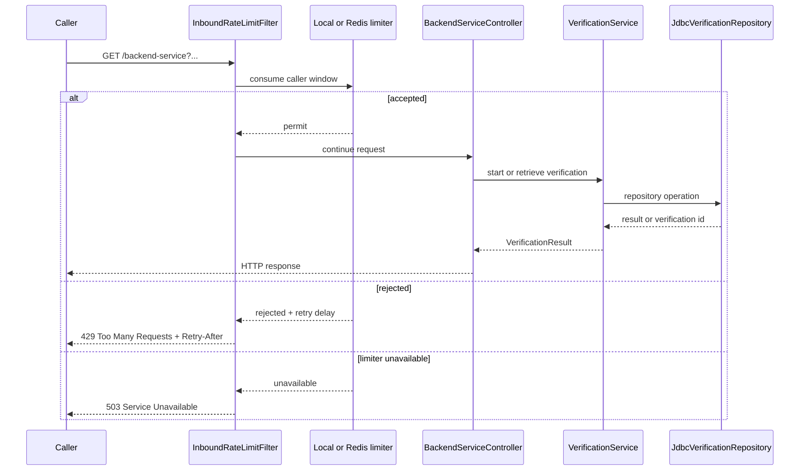
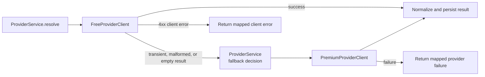
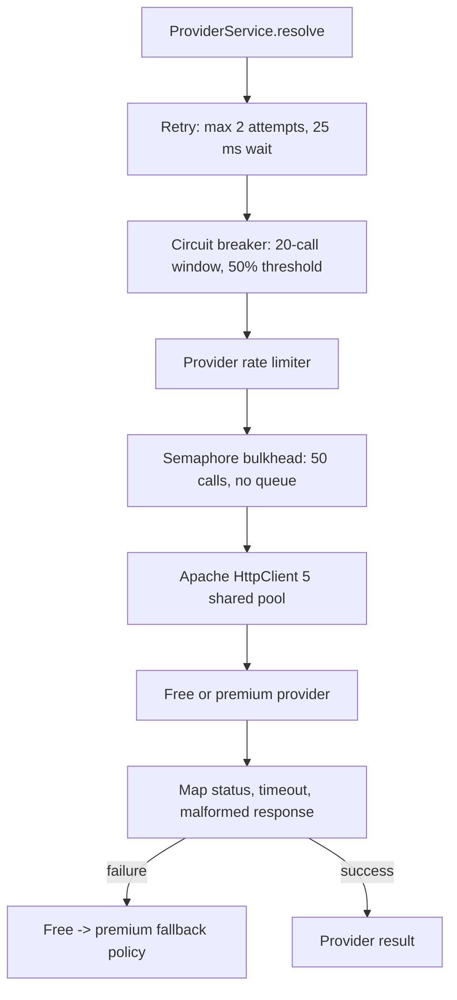
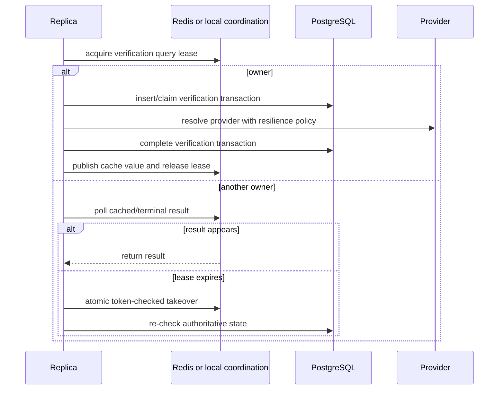

# Resilience, Admission, and Resource Controls

This reference explains how the service limits work, classifies failures, and
chooses a provider fallback. The application remains PostgreSQL-first:
Caffeine and Redis improve coordination and read performance, but neither is
the authoritative verification store.

## Request admission

`InboundRateLimitFilter` applies only to the backend GET endpoint. It runs
before controller binding and business orchestration, so rejected calls do not
consume database or provider capacity. The response includes a rounded-up
`Retry-After` value when the limiter supplies a retry delay.

| Deployment | Limiter | Default window | Degraded behavior |
|---|---|---:|---|
| `single-node` | Resilience4j local rate limiter | 100 requests / 1 second | A local limiter failure is unavailable; return 503 |
| `distributed` | Redis fixed-window Lua script | 100 requests / 1 second across replicas | Redis failure is unavailable; return 503 rather than bypassing the limit |

Retrieval requests are intentionally kept outside the provider admission
path. A completed verification can be read from PostgreSQL without spending a
provider quota or a provider bulkhead slot.

## Provider resolution and fallback

The resolution order is free provider first and premium provider second. The
`ProviderService` permits fallback for `Unavailable`, `Timeout`, and `Malformed`
failures, plus an empty successful FREE result. A provider `ClientError` is a caller or
contract problem and is returned without silently charging the premium
provider. If the fallback also fails, the final failure is persisted/mapped
according to `VerificationService` and its HTTP error policy.

The free-provider call can reach the fallback path because of:

- connection, DNS, socket, or response timeout failures;
- a 5xx or otherwise transient upstream response;
- an invalid response body or provider contract violation;
- an open circuit, exhausted bulkhead, or provider rate-limit rejection.

The provider client translates HTTP 4xx responses to `ClientError`, 5xx and other
unsuccessful responses to transient failures, socket timeouts to `Timeout`,
and malformed payloads to `Malformed`. Resilience4j rejection is represented
as provider unavailability. This keeps infrastructure exceptions out of the
service model while preserving the fallback decision.

## Provider resilience pipeline

The order protects progressively scarcer resources. Retry is bounded and is
used for transient calls; the circuit breaker stops repeated calls while an
upstream is unhealthy; rate limiting protects the provider quota; the
bulkhead rejects immediately when in-flight work is full; and only admitted
calls acquire an HTTP connection. The circuit uses a 20-call sliding window,
requires 10 calls before evaluation, opens at 50% failure, waits 10 seconds,
and permits two half-open calls.

`config.ProviderResilienceConfiguration` wires the single-node
`FreeProviderClient` and `PremiumProviderClient`; the distributed configuration
wires their Redis-aware counterparts. The wrappers share the provider
fixed-window decision through Redis in distributed mode and retain local retry,
circuit-breaker, and semaphore controls on every replica. Redis quota rejection
follows the same fallback classification as a provider-unavailable failure.

## HTTP connection pools and time bounds

Apache HttpClient 5 uses a shared connection manager for the provider clients:

| Control | Default | Effect |
|---|---:|---|
| Total connections | 100 | Global socket bound across provider routes |
| Connections per route | 50 | Prevents one provider from consuming the whole pool |
| Pool acquisition timeout | 100 ms | Fails quickly when all connections are busy |
| Connect timeout | 150 ms | Bounds TCP connection establishment |
| Response/socket timeout | 400 ms | Bounds waiting for provider data |
| Validate after inactivity | 5 seconds | Avoids reusing stale idle connections |
| Idle eviction | 30 seconds | Reclaims unused connections |

The pool bound is separate from the semaphore bulkhead and from virtual-thread
capacity. Virtual threads make blocking waits inexpensive; they do not create
more database connections, HTTP sockets, provider quota, or permits.

## Persistence, cache, and coordination failures

| Component | Normal role | Failure behavior |
|---|---|---|
| PostgreSQL | Authoritative verification state and terminal result | Bounded database retry; if unavailable, fail the operation rather than inventing state |
| Caffeine | Single-node L1 query cache | Cache miss; PostgreSQL remains the source of truth |
| Redis cache | Distributed L2 query cache | Read failure becomes a miss; write failure does not invalidate a successful local/DB result |
| Query lease | Prevents duplicate provider work | Wait for the owner; bounded takeover; Redis failure returns coordination unavailable |
| Expiration lease | Ensures one reaper owner across replicas | Skip this cycle when coordination is unavailable; the next scheduled cycle retries |

Database operations run with a bounded transaction retry policy: three
attempts, starting at 50 ms with multiplier 2 and a 500 ms maximum delay. A
successful start is committed before the result is published to waiters. A
cache entry never replaces the transactional PostgreSQL claim or completion
decision.

## Query and expiration coordination

The distributed query lease has a 20-second TTL and polls every 50 ms for at
most 20 attempts. Takeover is token-checked and revalidates PostgreSQL before
provider work begins. The local profile uses Caffeine and an in-process lock.

Expiration runs once on application readiness and then on a fixed one-second
delay. In the distributed profile, one replica acquires the Redis expiration
lease; the owner drains at most 100 rows per batch using PostgreSQL row locks
with `FOR UPDATE SKIP LOCKED`, marks expired records, and releases the lease
with a random-token compare-delete. If a replica dies, the 30-second lease TTL
allows a later replica to take over. Stale database claims are cleared as part
of expiration handling.

## Cache lifetime and freshness

- Positive query results are cached for 24 hours.
- Negative/no-match results are cached for 10 minutes with jitter to reduce
  synchronized expiry.
- The verification lifetime is 10 minutes by default and is injected as the
  named `verificationLifetime` `Duration` bean from
  `VerificationProperties`, not hard-coded in the use case.
- Cache expiry is an optimization; verification expiration and status remain
  PostgreSQL decisions.

## Error surface

| Boundary | Response | Meaning |
|---|---:|---|
| Inbound limiter rejected | 429 | Caller exceeded the configured request window |
| Inbound limiter unavailable | 503 | Admission state cannot be safely coordinated |
| Validation or provider client error | 4xx | Request/provider contract is not retryable |
| Provider exhausted after fallback | 502/503 mapping | No usable provider result is available |
| PostgreSQL unavailable after bounded retry | 503 | Authoritative state cannot be read or written |
| Duplicate query still in progress | Accepted/polling contract | Caller receives the existing verification lifecycle rather than duplicate work |

Exact status and problem payload fields remain defined by the OpenAPI contract
and controller exception mapping; this table describes the operational intent.

## Observability of resilience

Micrometer metrics expose request outcomes, rate-limit decisions, provider
attempts, retries, circuit state, bulkhead rejections, HTTP pool timing,
database pool usage, cache hits/misses, lease outcomes, expiration batches,
and verification lifecycle durations. Traces are exported through OTLP to
Grafana Alloy, while container logs are collected by Alloy into Loki.
Prometheus scrapes `/actuator/prometheus`; Grafana correlates metrics, Tempo
traces, and Loki logs. The complete topology and local endpoints are in the
[runtime architecture](runtime-architecture.md).
