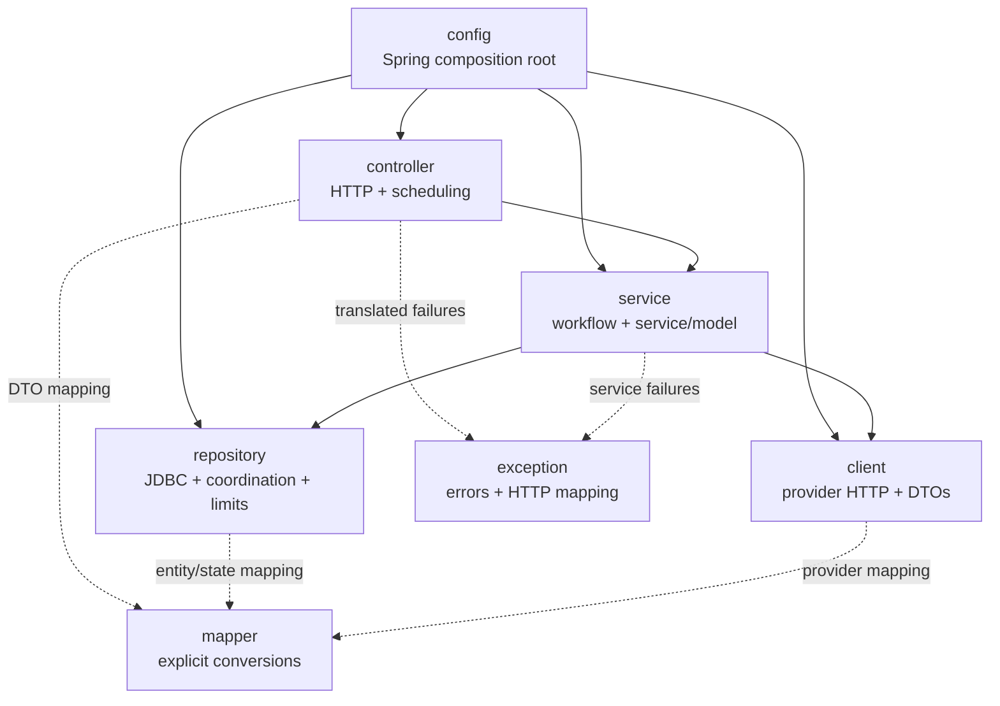
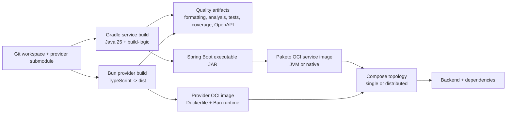
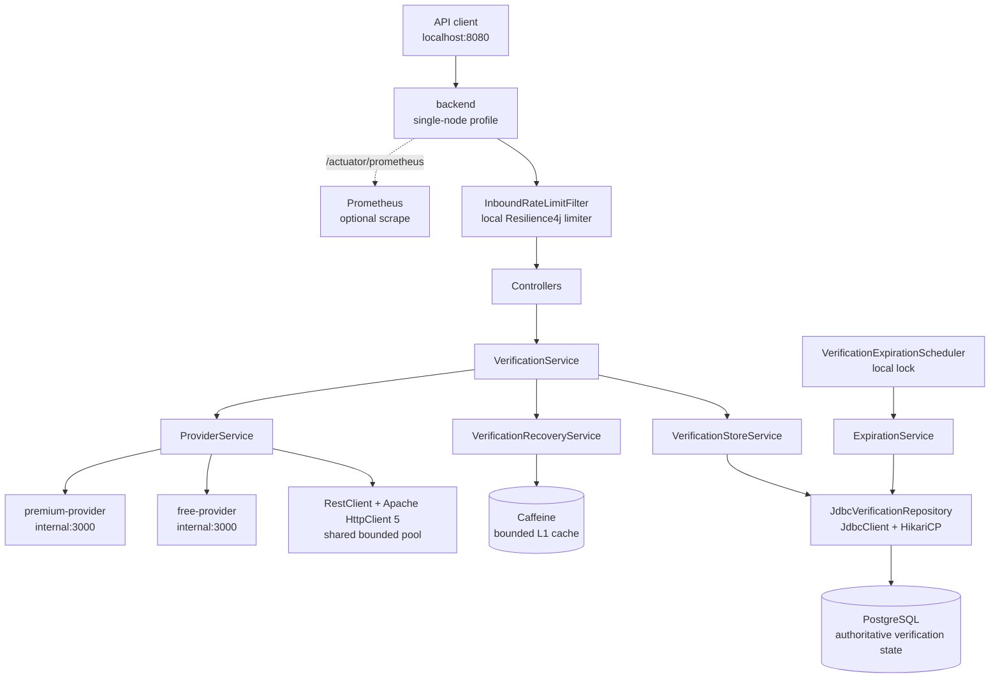
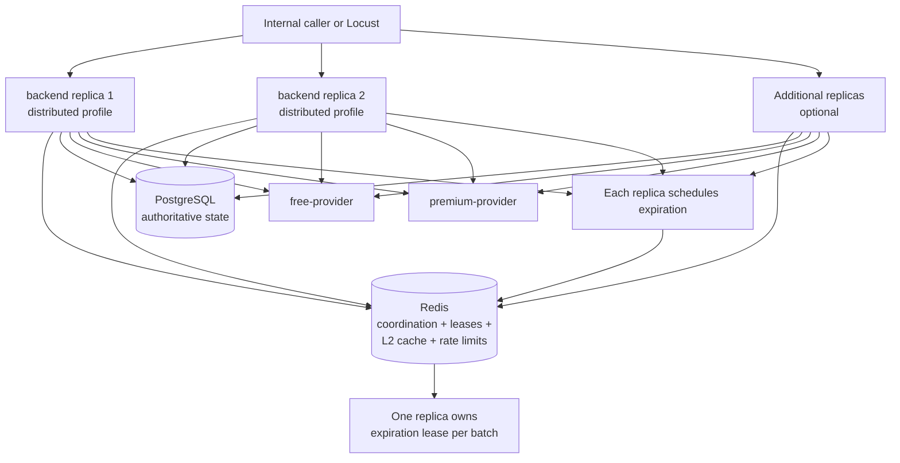
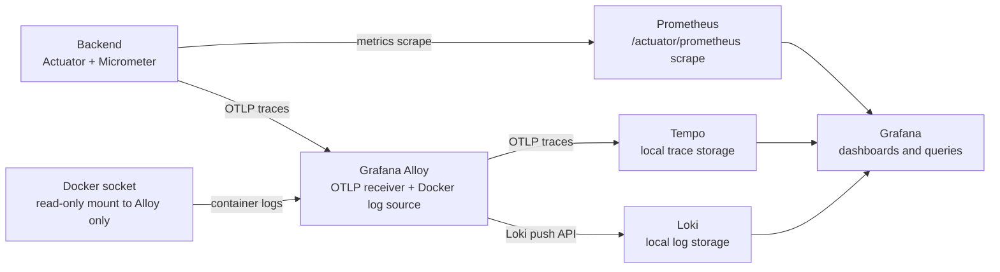

# Runtime Architecture

This document describes the current source layers, build artifacts, Compose
topologies, observability overlay, and resource bounds. Source code and Compose
files remain authoritative if implementation changes before this page does.

## Backend layers

| Package | Responsibility | Boundary rule |
|---|---|---|
| `config` | Spring wiring, profiles, properties, HTTP clients, resilience, persistence, cache, rate limits, and native hints | Composes implementations; contains no workflow decisions |
| `controller` | `BackendServiceController`, `VerificationController`, `InboundRateLimitFilter`, `VerificationExpirationScheduler`, and API DTOs | Does not call repositories or provider clients directly |
| `service` | `VerificationService`, `ProviderService`, `VerificationStoreService`, `VerificationRecoveryService`, `ExpirationService`, and `service/model` | Does not depend on MVC, JDBC, Redis, HTTP client internals, entities, or provider DTOs |
| `repository` | `VerificationRepository`, `JdbcVerificationRepository`, entities, coordination, leases, cache, and rate-limit implementations | Owns external state and persistence entities |
| `client` | `ProviderClient`, typed FREE/PREMIUM clients, provider transport handling, and client DTOs | Owns provider wire types and HTTP integration |
| `mapper` | `VerificationMapper`, `ProviderMapper`, `VerificationStateMapper`, and reconciliation mapping | Performs small, explicit representation conversions |
| `exception` | Business/integration exception hierarchy and `GlobalExceptionHandler` | Keeps HTTP error translation at the boundary |

The single `verification` Modulith module and layered ArchUnit tests protect
these rules. The legacy `adapter`, `application`, and `domain` production
packages were removed by the layered migration.

## Build and artifact pipeline

### Service artifacts

- Gradle Kotlin DSL and included `build-logic` own build conventions.
- Dependency locking/verification, Spotless, Checkstyle, Detekt, Error Prone,
  NullAway, JaCoCo, and OpenAPI validation run through focused gates.
- `fastCheck` runs local formatting, static analysis, unit tests, and coverage.
- `qualityGate` adds contract tests, integration tests, OpenAPI validation, and
  build-logic checks.
- `bootJar` creates the executable Spring Boot artifact.
- `image` delegates OCI creation to Spring Boot Paketo integration.
- `imageSmoke` verifies startup and the non-root runtime contract.

### Provider artifacts

- `bun run build` compiles TypeScript into `dist`.
- The provider Dockerfile installs from `bun.lock`, copies runtime fixtures and
  scenarios, and runs as the `bun` user.
- One image runs as both the FREE and PREMIUM deterministic simulators using
  different `PROVIDER_TIER` and scenario-file settings.

### Compose inputs

| File | Role |
|---|---|
| `compose.yaml` | Backend, provider simulators, PostgreSQL, internal network, debug backend, and optional Locust |
| `compose.single.yaml` | `single-node` profile and host-published backend port |
| `compose.distributed.yaml` | `distributed` profile, Redis, scaled replicas, and no host port for individual backends |
| `compose.observability.yaml` | Prometheus, Grafana, Tempo, Loki, Alloy, and telemetry overrides |

Development may use local tags. CI/release validation requires digest-pinned
backend, provider, PostgreSQL, Redis, and Locust references; the performance
runner resolves local tags to repository digests before starting Compose.

## Single-node architecture

Single-node does not start Redis. `LocalCoordinationRepository` and
`LocalExpirationLock` provide in-process coordination; Caffeine remains the
bounded local cache. PostgreSQL owns verification identity, status, expiry,
claims, and terminal result state.

## Distributed architecture

Redis provides shared query leases, cache entries, inbound/provider fixed-window
limits, and the expiration lease. It never becomes verification truth;
PostgreSQL transactions and row locks remain authoritative. The distributed
overlay removes the host backend port; `--scale backend=N` controls replicas.

## Observability architecture

The optional observability profile starts Prometheus, Grafana, Tempo, Loki, and
Alloy. The backend has no Docker socket mount. Local Loki and Tempo storage has
no authentication and is not a production topology.

## Resource boundaries

| Resource | Default bound | Purpose |
|---|---:|---|
| Hikari database connections | 16 max / 4 minimum idle | Bounds PostgreSQL connections |
| Provider HTTP connections | 100 total / 50 per route | Bounds shared provider sockets |
| Provider connection wait | 100 ms | Fails fast when the HTTP pool is exhausted |
| Provider connect / response timeout | 150 ms / 400 ms | Bounds remote call lifetime |
| Provider bulkhead | 50 calls per provider | Bounds in-flight provider work |
| Provider retries | 2 attempts, 25 ms wait | Bounds transient retry amplification |
| Inbound rate limit | 100 requests per 1 s | Protects the backend endpoint |
| Provider rate limit | 100 calls per provider per 1 s | Protects provider quotas |
| Redis coordination wait | 20 attempts × 50 ms | Bounds duplicate-query waiting |
| Expiration batch | 100 rows | Bounds each reaper transaction |
| Virtual threads | Enabled | Makes blocking waits cheaper; does not remove resource bounds |

Values are externalized in `application.yml` and profile overrides. Review any
bound change against DB capacity, provider quotas, and workload targets.
