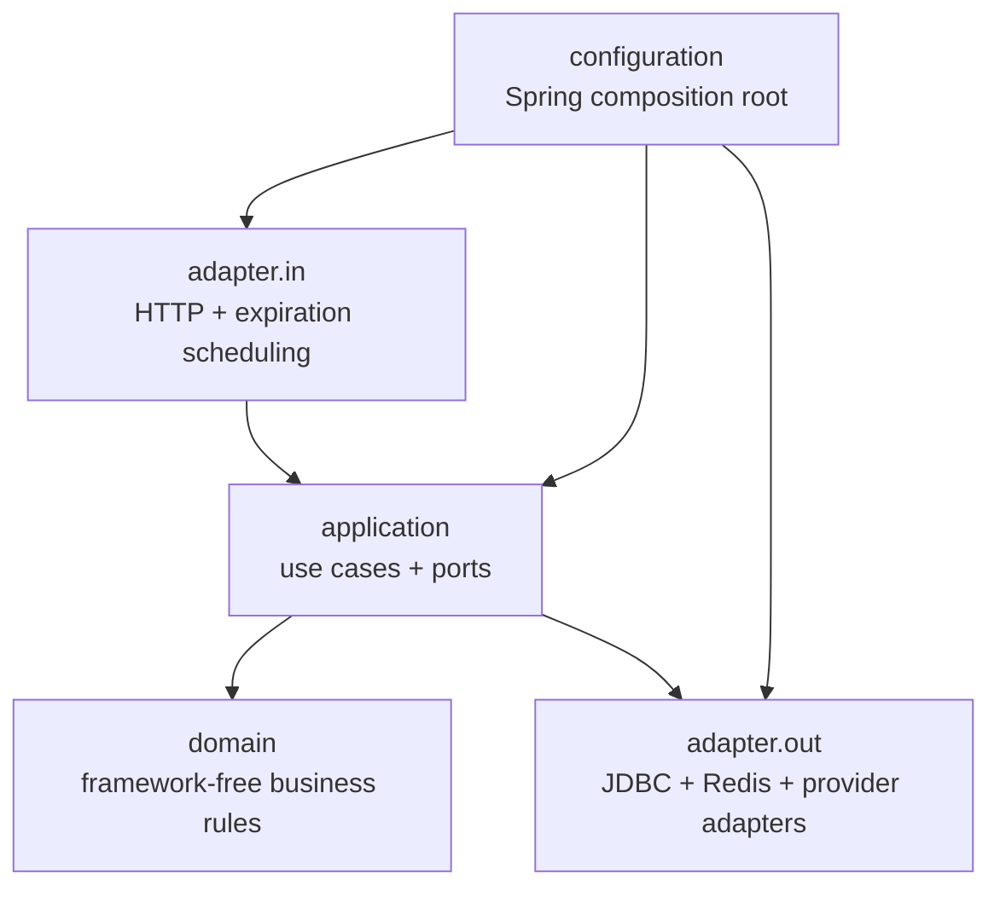
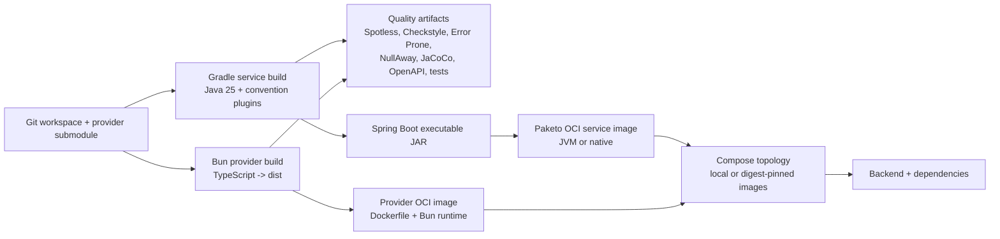
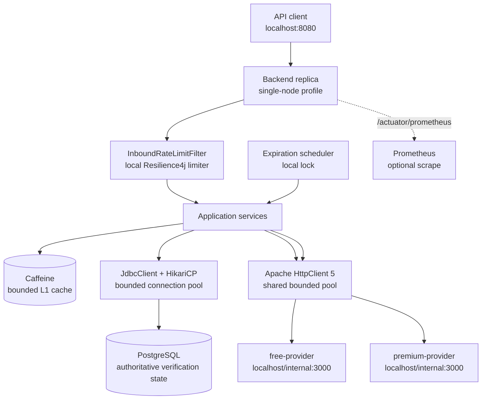
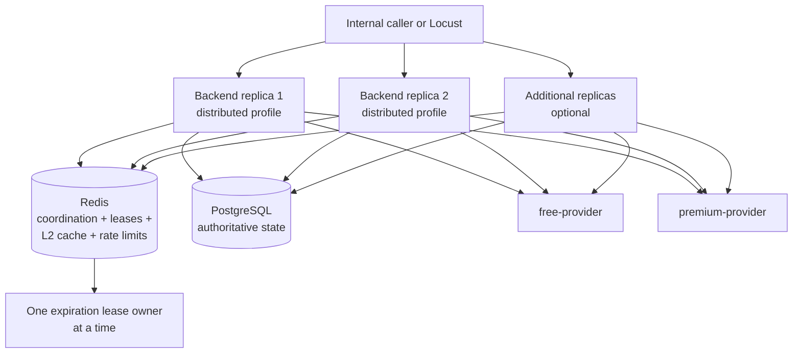
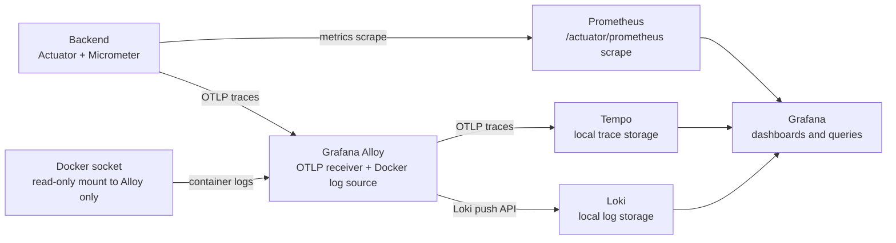

# Runtime Architecture

This document describes the system from source code and build artifacts to
running services and observability. The source tree and Compose files remain
the final authority when an implementation changes.

## Architecture layers

The package responsibilities are:

| Package | Responsibility | Not allowed to own |
|---|---|---|
| `domain` | Verification lifecycle, provider results/failures, normalization, fallback decision | Spring, JDBC, Redis, HTTP, caching, infrastructure |
| `application` | Use cases, ports, orchestration, PostgreSQL-first decisions | Concrete adapters or Spring configuration |
| `adapter.in.web` | HTTP mapping, validation boundary, exception/problem responses, inbound admission filter | Business state transitions |
| `adapter.in.scheduling` | Startup recovery and periodic expiration trigger | Persistence or lease implementation |
| `adapter.out.persistence` | JdbcClient SQL, JSONB state codec, PostgreSQL mapping | Provider or HTTP policy |
| `adapter.out.coordination` | Local/Caffeine or Redis cache, query leases, expiration leases | Verification truth |
| `adapter.out.provider` | Provider HTTP mapping and resilience wrappers | Application workflow |
| `adapter.out.ratelimit` | Local Resilience4j or Redis fixed-window admission | HTTP response mapping |
| `configuration.*` | Spring beans, profiles, externalized properties, resource limits | Domain behavior |

Configuration properties are grouped under `configuration.application`,
`persistence`, `coordination`, `provider`, `web`, and `observability`. The
records are immutable configuration inputs; application services receive ports
and plain values, while infrastructure adapters may receive the records from
the composition root.

## Build and artifact pipeline

### Service artifacts

- Gradle Kotlin DSL and included `build-logic` own build conventions.
- Dependency locking and dependency verification protect resolved artifacts.
- `fastCheck` runs local formatting, static analysis, unit tests, and coverage.
- `qualityGate` adds contract tests, integration tests, OpenAPI validation, and
  build-logic checks.
- `bootJar` creates the executable Spring Boot artifact.
- `image` delegates OCI creation to Spring Boot's Paketo integration and
  requires immutable builder and run-image references.
- `imageSmoke` verifies the local image starts and exits within a bounded
  deadline while preserving the image's non-root runtime contract.

### Provider artifacts

- `bun run build` compiles the production TypeScript tree into `dist`.
- The provider Dockerfile installs from `bun.lock`, copies only production
  runtime assets and deterministic fixtures/scenarios, and runs as the `bun`
  user.
- The image exposes health endpoints and is used by both Compose and the
  service's provider contract tests.

### Compose inputs

Compose uses overlays:

| File | Role |
|---|---|
| `compose.yaml` | Backend, provider simulators, PostgreSQL, internal network, optional Locust service |
| `compose.single.yaml` | `single-node` profile and host-published backend port |
| `compose.distributed.yaml` | `distributed` profile, Redis, two or more replicas, no individual host backend port |
| `compose.observability.yaml` | Prometheus, Grafana, Tempo, Loki, Alloy, and observability environment overrides |

Development may use local tags. CI/release validation requires digest-pinned
references for the backend, provider, PostgreSQL, Redis, and Locust images. The
performance runner resolves locally available tags to repository digests before
starting its stack.

## Single-node architecture

Single-node does not start Redis. The coordination port uses local in-process
leases and Caffeine. PostgreSQL still owns verification identity, status,
expiry, claim ownership, and terminal result state. The provider simulators are
separate containers even though coordination is local.

## Distributed architecture

Redis is a coordination and leasing layer, not the source of verification
truth. It provides a distributed query lease, expiration lease, shared cache
entries, inbound fixed-window rate limiting, and provider fixed-window rate
limiting. PostgreSQL transactions and row locks remain authoritative when a
Redis value is missing, stale, unavailable, or contested.

The distributed overlay removes the host port from `backend` because multiple
replicas must be reached through an internal caller, Locust, or a separate load
balancer. Compose's `--scale backend=N` controls the replica count.

## Observability architecture

The optional observability profile starts:

| Component | Function | Default host endpoint |
|---|---|---|
| Prometheus | Scrapes backend `/actuator/prometheus`; retains metrics for the configured period | `http://localhost:9090` |
| Grafana | Queries Prometheus, Tempo, and Loki; provisions data sources | `http://localhost:3000` |
| Tempo | Receives OTLP traces through Alloy and stores them on a local volume | `http://localhost:3200` |
| Loki | Receives structured container logs through Alloy | `http://localhost:3100` |
| Alloy | Receives OTLP traces and reads Docker logs through a read-only socket | `http://localhost:12345` |

The backend has no Docker socket mount. The local profile enables tracing to
Alloy and uses full sampling for smoke/debug observability. The base profile
keeps OTLP exporters disabled unless explicitly configured. Local Loki and
Tempo storage has no authentication and is not a production topology.

## Resource boundaries

The important limits are explicit and independent:

| Resource | Default bound | Purpose |
|---|---:|---|
| Hikari database connections | 16 max / 4 minimum idle | Bounds PostgreSQL connections |
| Provider HTTP connections | 100 total / 50 per route | Bounds sockets shared by free and premium clients |
| Provider connection wait | 100 ms | Fails fast when the HTTP pool is exhausted |
| Provider connect / response timeout | 150 ms / 400 ms | Bounds remote call lifetime |
| Provider bulkhead | 50 calls per provider | Bounds in-flight provider work |
| Provider retries | 2 attempts, 25 ms wait | Bounds transient retry amplification |
| Inbound rate limit | 100 requests per 1 s | Protects the backend endpoint |
| Provider rate limit | 100 calls per provider per 1 s | Protects provider quotas |
| Redis coordination wait | 20 attempts × 50 ms | Bounds duplicate-query waiting |
| Expiration batch | 100 rows | Bounds each reaper transaction |
| Virtual threads | Enabled | Makes blocking waits cheaper; does not remove resource bounds |

The values are externalized in `application.yml` and grouped in the
`configuration` package. Changing one bound should be reviewed against the
others, database capacity, provider quotas, and workload targets.
