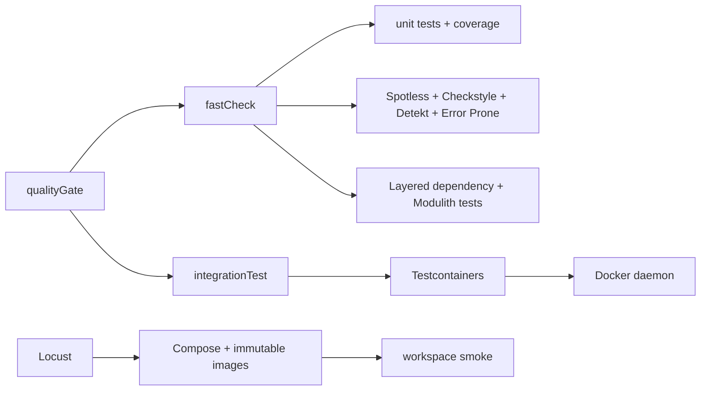

# Testing and Performance

## Service checks

- `mise run doctor` verifies tools, submodules, the Docker daemon, and memory
  before any gate.
- `mise run validate` invokes the service's `fastCheck` gate with the correct
  Gradle project path.
- `mise run service-full` invokes the complete `qualityGate`; it still needs
  PostgreSQL and Redis Testcontainers.
- `mise run integration`, `mise run contract`, `mise run e2e`, and
  `mise run openapi` run the individual service suites/gates directly.
- `mise run provider` installs the locked Bun dependencies before running the
  provider quality checks.
- `mise run provider-security` and `mise run provider-licenses` run the Trivy
  and Licensee checks.
- `mise run verify` runs the service gate, provider quality, provider security,
  and Compose overlays in one pass.
- `mise run image-smoke` builds the service image and runs the bounded Docker
  smoke check.
- `mise run compose-check` renders the single-node, distributed, and
  observability Compose overlays without starting containers.
- `./company-check-service/gradlew -p company-check-service fastCheck` runs the
  service's local unit/quality bundle: formatting, static analysis, unit tests,
  and JaCoCo coverage.
- `./company-check-service/gradlew -p company-check-service qualityGate` adds
  integration, contract, and E2E test suites, OpenAPI validation, and the
  included Gradle build-logic check.
- Integration tests use PostgreSQL and Redis Testcontainers.
- Contract tests exercise the HTTP boundary against the service contract, while
  `openApiValidate` lints `openapi/backend-api.yaml` and the nested service
  copy. Compose E2E checks validate the assembled runtime images and profile
  overlays.
- JaCoCo reports cover service/model and workflow logic while repository
  integration behavior is exercised separately against real PostgreSQL/Redis
  containers.
- `LayeredDependencyTest`, `LayerPackageStructureTest`, and
  `ServiceModelArchitectureTest` verify controller/service/repository/client
  dependency direction and prevent provider DTOs, repository entities, or
  transport types from leaking across boundaries.
- Build artifacts are checked through `bootJar`, Paketo image validation, image
  smoke checks, dependency locks, and dependency verification metadata.
- On Colima or another VM-backed Docker context, `mise run service-full`
  exports the Docker host and socket override automatically (the shared
  `scripts/mise-gradle.sh` helper applies it to every service Gradle task).
  For manual `gradlew` runs, set the override described in the workspace README.
- Use `docker compose` where the Compose v2 plugin is installed; the equivalent
  `docker-compose` command is supported by the performance runner.

The complete local image setup is available through `mise run setup-jvm` or
`mise run setup-native`. Both build the provider and service images, start the
single-node stack, and wait for health; they do not replace `qualityGate` or
the performance runner. Allocate 4 GiB of Docker memory for the JVM setup and
12 GiB for the native setup. The JVM path may be attempted with 2 GiB, but it
is a constrained lower bound and can fail from Gradle/Paketo overhead.

## Performance checks

`company-check-service/performance/run.sh` starts the performance Compose stack,
waits for the backend health check, runs the version-controlled Locust scenario,
writes HTML/CSV artifacts, enforces the configured aggregate failure-rate and
p95 latency thresholds, and tears the stack down on exit. The smoke scenario
uses five users for 30 seconds by default. The manual/reusable
`.github/workflows/performance.yml` workflow runs a stricter 10-user, 60-second
bounded stress profile and uploads the artifacts for review.

The runner supports both `single` and `distributed` topologies. In distributed
mode it scales the backend replicas and requires immutable or locally resolvable
image references; it does not assume that a host-published backend port exists.

## CI pipeline

`.github/workflows/ci.yml` is the single orchestration graph. It runs quality,
security, image build, E2E, and performance stages under one `plan` job that
decides which stages execute from the workflow dispatch inputs; on push and
pull requests every stage defaults to on. The reusable leaves are
`component` quality jobs, `.github/workflows/build-images.yml`,
`.github/workflows/e2e.yml`, and `.github/workflows/performance.yml`. Image
builds publish immutable `validation-<sha>-<variant>` references that E2E,
Locust, and the container security scan consume by digest.

Caching is applied across the graph: the Gradle home and build cache through
`gradle/actions/setup-gradle`, the Bun install cache and provider `node_modules`
through `actions/cache`, provider image layers through
`docker/build-push-action` GHA cache mode, and the immutable
PostgreSQL/Redis/Locust infrastructure images through `docker load`/`save`
tarballs keyed by digest.

Security results (CodeQL, Gitleaks, Trivy filesystem/image, dependency-lock
verification, and SPDX SBOM generation) are reported to code scanning with SARIF
uploads and workflow artifacts. High and critical vulnerabilities fail the
relevant job; lower-severity findings remain available in SARIF and workflow
artifacts. Dependency-review runs on pull requests only after the repository
dependency graph is available and the `DEPENDENCY_GRAPH_ENABLED` variable is set
to `true`; it is intentionally not a required check. All composite and workflow
actions are pinned to commits whose runtimes use Node 24 to stay clear of the
deprecated Node 20 runner.
For organization-owned repositories, configure the free `GITLEAKS_LICENSE`
repository or organization secret so the Gitleaks action can scan history.
