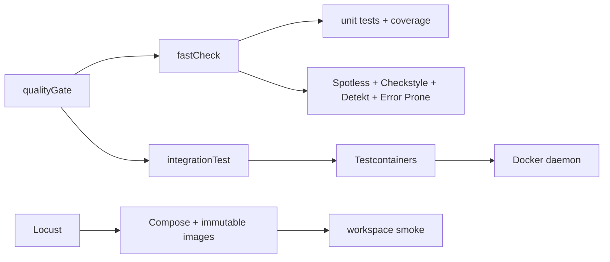

# Testing and Performance

## Service checks

- `./company-check-service/gradlew -p company-check-service fastCheck` runs fast local checks.
- `./company-check-service/gradlew -p company-check-service qualityGate` adds integration tests and OpenAPI validation.
- Integration tests use PostgreSQL and Redis Testcontainers.
- On Colima or another VM-backed Docker context, set the Docker host and socket
  override described in the workspace README.

## Performance checks

`company-check-service/performance/run.sh` starts the performance Compose stack,
waits for the backend health check, runs the version-controlled Locust scenario,
writes HTML/CSV artifacts, and tears the stack down on exit. The smoke scenario
uses five users for 30 seconds by default. `PERFORMANCE_FAILURE_PERCENT` is a
tracked comparison target; the current runner emits the Locust results and does
not yet fail the process from that threshold automatically.
